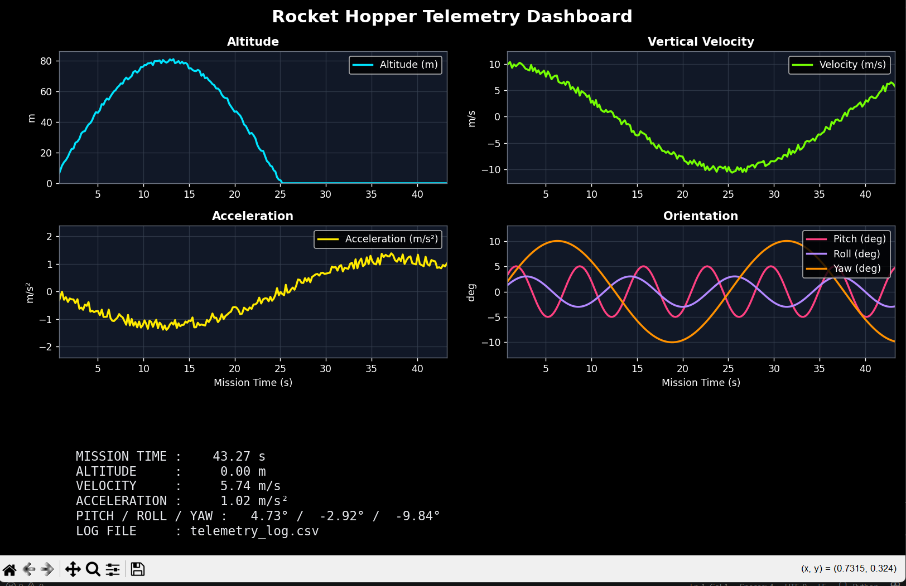

# Rocket Telemetry Dashboard

**Telemetry, Logging, and Real-Time Monitoring System**

---

## Overview

This project implements a simplified telemetry pipeline for a rocket hopper simulation. It demonstrates how flight data is generated, processed, logged, and visualized in real time, similar to a basic ground station system.

The focus is on building a system that reflects real aerospace workflows, including continuous data streams, time synchronization, and reliable logging under real-time constraints.

---

## System Architecture

The system is implemented as a **single-process pipeline** for simplicity, but is structured to reflect a real telemetry system.

### Components

#### Telemetry Generator (Vehicle Simulation)

* Generates telemetry data at ~50–100 Hz
* Simulated parameters:

  * Timestamp
  * Altitude
  * Vertical Velocity
  * Acceleration
  * Orientation (Pitch, Roll, Yaw)

#### Processing Loop (Ground System)

* Handles incoming data in real time
* Updates visualization
* Logs telemetry continuously to file

---

### Data Flow

```
Telemetry Generator → Processing Loop → Logging + Visualization
```

> Note: This implementation is single-process for simplicity, but the architecture is designed to be extended into a distributed system using UDP for vehicle-to-ground communication.

---

## Features

* Real-time telemetry simulation (~50–100 Hz)
* Live dashboard with multiple parameters:

  * Altitude
  * Velocity
  * Acceleration
  * Orientation (Pitch, Roll, Yaw)
* Color-coded visualization for clarity
* Continuous CSV logging (`telemetry_log.csv`)
* Rolling time window for stable visualization
* Live status panel displaying current telemetry values

---

## Tech Stack

* Python
* Matplotlib (real-time visualization)
* CSV (data logging)

---

## How to Run

### 1. Install dependencies

```bash
pip install -r requirements.txt
```

### 2. Run the dashboard

```bash
python run_telemetry_dashboard.py
```

---

## Output

### Real-Time Dashboard

* Multi-panel visualization with smooth updates
* Dark theme optimized for readability
* Color-coded signals:

  * Altitude (cyan)
  * Velocity (green)
  * Acceleration (yellow)
  * Orientation (multi-color)

### Logged Telemetry

* File: `telemetry_log.csv`
* Contains timestamped telemetry data
* Suitable for post-flight analysis or replay systems

---

## Design Decisions

### 1. Fixed-Rate Simulation Loop

A deterministic loop (~50–100 Hz) is used to simulate real flight computer timing, ensuring predictable and consistent data flow.

### 2. Continuous CSV Logging

* File remains open during execution for performance
* Minimizes I/O overhead and avoids blocking
* Trade-off: Not ideal for very high-throughput systems

### 3. Matplotlib Dashboard

* Chosen for rapid prototyping and simplicity
* Provides real-time visualization with minimal setup
* Trade-off: Limited scalability compared to web-based dashboards

### 4. Rolling Buffer for Visualization

* Maintains a fixed window of recent data
* Prevents performance degradation over time
* Ensures smooth and stable graph updates

---

## Handling Real-Time Constraints

The system reflects key real-world considerations:

* **Timing:** Fixed-rate loop approximates flight software cycles
* **Continuity:** Logging and visualization run without interrupting data flow
* **Traceability:** All telemetry is timestamped for post-flight analysis

---

## Limitations

* No communication layer (UDP/TCP not implemented)
* No packet loss or latency simulation
* No fault tolerance or redundancy mechanisms
* Visualization limited to local execution

---

## Future Improvements

To evolve toward a production-like telemetry system:

* Implement UDP-based telemetry streaming
* Simulate packet loss, latency, and jitter
* Introduce asynchronous or buffered logging
* Replace matplotlib with a web-based dashboard (Streamlit/Dash)
* Add replay system for logged telemetry data
* Improve physical realism of the simulation model

---

## Why This Matters

In real rocket systems:

* Telemetry is critical for **flight safety** and **post-flight analysis**
* Ground systems must handle **continuous, high-frequency data streams**
* Logging must be **reliable and non-blocking**
* Visualization enables **real-time decision-making**

This project demonstrates a foundational version of a real-world telemetry pipeline used in rocket flight systems.

---

## Demo



---

## Author Notes

This implementation prioritizes clarity, reliability, and system design over complexity. The structure is intentionally modular so that features like networking, fault handling, and scalability can be added without major redesign.
